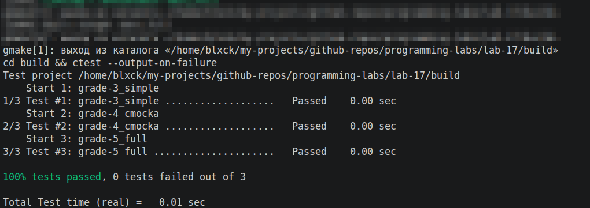

# Лабораторная работа №17 — Unit-тестирование

  

> Покрыть тестами **чужой** код (требование PDF: «обязательно — чужой, не свой»). Взят миниатюрный парсер арифметических выражений [tinyexpr](https://github.com/codeplea/tinyexpr) — один `.c` файл, понятное API, легко тестировать.

## 📦 Тестируемая библиотека

[external/tinyexpr](external/tinyexpr) — копия проекта с GitHub (лицензия zlib, см. [LICENSE](external/tinyexpr/LICENSE) — копировать разрешено).

Публичное API:

```c
double te_interp(const char *expression, int *error);
// "3 + 4 * 2" → 11.0, error = 0
// "1 +"      → 0.0,  error = 3 (позиция ошибки)
```

## 📊 Привязка к оценкам

| Grade | Подход | Файл | Особенности |
|---|---|---|---|
| 3 ★   | Голый `assert.h` | [grade-3/test_simple.c](grade-3/test_simple.c) | Без фреймворка, простая демонстрация принципа |
| 4 ★★  | CMocka + табличные тесты | [grade-4/test_cmocka.c](grade-4/test_cmocka.c) | `[ RUN ] ... [ OK ]`, табличные кейсы |
| 5 ★★★ | + CMake + `ctest` | [grade-5/test_full.c](grade-5/test_full.c) | 23 теста, форматированный вывод как на скриншоте PDF |

## 🗂 Структура

```
lab-17/
├── README.md
├── CMakeLists.txt              # сборка всех 3 grade'ов + регистрация в ctest
├── external/
│   └── tinyexpr/
│       ├── tinyexpr.c          # 734 строки парсера-вычислителя (не правим)
│       ├── tinyexpr.h          # public API
│       └── LICENSE             # zlib (обязательно — условие копирования)
├── grade-3/
│   ├── test_simple.c           # 12 кейсов через assert()
│   ├── Makefile                # автономная сборка без CMake
│   └── README.md
├── grade-4/
│   ├── test_cmocka.c           # 5 тестов на CMocka
│   ├── Makefile
│   └── README.md
└── grade-5/
    ├── test_full.c             # 23 теста на CMocka
    └── README.md
```

## 📥 Установка зависимостей

```bash
sudo apt install libcmocka-dev cmake
```

## ⚙️ Запуск

Тремя способами — на выбор.

### 1. Через корневой Makefile-диспетчер (рекомендуется)

```bash
make test               # cmake + build + ctest --output-on-failure
make clean              # удалить build/ и бинарники grade-3/4
```

### 2. Напрямую через CMake + ctest

```bash
cmake -B build -S .
cmake --build build
cd build && ctest --output-on-failure
```



Результат:

```
    Start 1: grade-3_simple
1/3 Test #1: grade-3_simple ...................   Passed    0.00 sec
    Start 2: grade-4_cmocka
2/3 Test #2: grade-4_cmocka ...................   Passed    0.00 sec
    Start 3: grade-5_full
3/3 Test #3: grade-5_full .....................   Passed    0.00 sec

100% tests passed, 0 tests failed out of 3
```

### 3. Запуск конкретной grade-папки через Makefile

```bash
cd grade-3 && make run     # обычные assert
cd grade-4 && make run     # CMocka
```

### 4. Только конкретный тест в ctest

```bash
cd build && ctest -R grade-5 --verbose
```

## 🧠 Что отрабатывается

- **Покрытие** чужого API набором проверок (входное значение → ожидаемый результат).
- **Граничные случаи**: `1/0`, `sqrt(-1)`, пустая строка, неверный синтаксис.
- **Особенности библиотеки**, выявленные тестами: `^` лево-ассоциативный в tinyexpr (`2^3^2 = 64`, не 512). Это **зафиксировано** в тесте `test_power_left_assoc` — если поведение поменяется, тест сразу провалится.
- **Tooling**: `find_library` в CMake для линковки CMocka, регистрация целей в `enable_testing()` + `add_test()`.

## 📚 Альтернативные фреймворки

PDF упоминает Google Test, Check и др. Я выбрал **CMocka** потому что:
- чистый C (без необходимости компилировать C++);
- ставится одной командой apt;
- понятный синтаксис `assert_int_equal` / `assert_true`;
- легко интегрируется в CMake (`find_library cmocka`).
